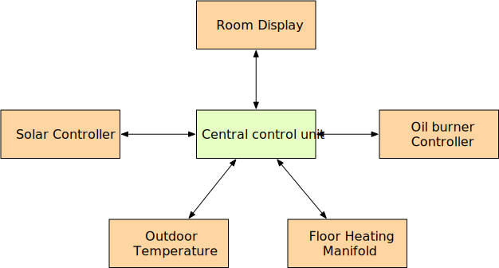

== Communication
Describes the communication between the devices and the central control unit.

=== Protocol
The communication is done by MQTT messages. It is a star communication where
all the messages where routed via the MQTT Broker on the central control unit.

=== Robustness
If the MQTT broker or the central control unit is not reachable the other devices
must work without it.

The data send to the unit is normally send once a minute. But if the broker
is not reachable the devices must store the data and need to resend it later
when the broker is reachable again. Even if this will take days.

When there is a user interaction on a device the data send/receive intervals
are switched to an interval of two seconds. The idea is to have a responsible
device for user satisfaction.

=== Hardware
As transmitter hardware is Wifi or LoraWan. Not clear yet.
