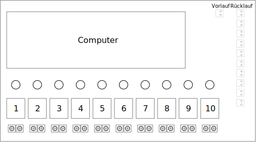

== Floor Heating Manifold
This device sits in the Floor Heating Manifold and has the following
functions: +

* Measure the temperatures of the return flow of each heating loop.
* Measure the inlet temperature for all the heating loops.
* Switch the valves of each heating loop.
* It also has a button for each heating loop to switch the status manually. This
overwrites the commands fron the central control unit until it is explicitly
reseted.

=== Device Mockup

=== Function
The temperatures are send every minute to the central control unit. And it will
read the commands
