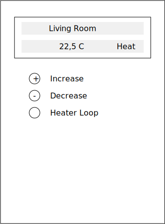

== Room Display
The room display is a small device which could be mounted to the wall
or could be placed on some furniture.

The room display has the following functions: +

* Display the current temperature in the room.
* Allow the user to set the expected temperature.

=== Device Mockup

=== Function
The controller is continuously measuring the temperature. Every minute
the actual temperature is send via MQTT to the central control unit.

Also the expected temperature is send to the control unit. It is more
save to send it every time so if something happened to the control unit
the data will be updated after one minute.

If the expected temperature is changed the data will be send immediately.

It also shows if the system should heating/cooling/off and also if the system
is heating/cooling/off. For example if the user increase the expected temperature
above the actual temperature it shows that it will heat. After the central control
unit has confirmed that the system is heating the status will be shown.

If the controller could not send the MQTT messages because of any connection
problems, the controller will sore the messages and send them later. So that
the history of the temperature curve could be created.

The Device reads the MQTT every minute to update the information. If an user
is changing settings, the device should read the MQTT every second for about 5
minutes to to more responsive.

=== Communication
Currently it is in test if WLAN or LORAWan is used.

=== Open Questions
* If the underfloor heating  in the room is splitted in multiple
parts it could be that one is working and one is not.

* The temperature of the return flow for each heater loop should be visible. How
should this be done?
