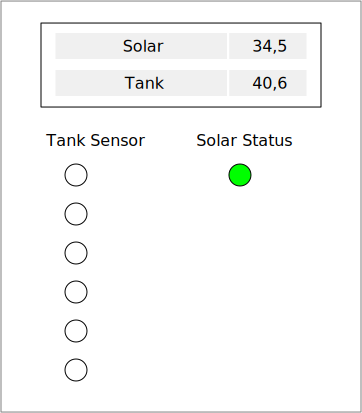

== Solar Controller / Oil Burner Controller
This controller is the main controller in the room where the heater and
the hot water tank is. It has many functions.

=== Device Mockup
This mock up needs to be discussed and changed. May be it makes sense to use
a bigger display to show the data.

=== Function

Tank temperature::
The tank temperature is monitored by about 6 sensors to show the
temperature distribution from the top to the bottom of the tank.

Hot water::
A temperature sensor on the hot water pipe. This shows when hot water is used.
This information could be used to optimise the timing of  the circulation pump.

Solar::
Measures the temperature of the solar panel and switches the solar pump.
For this a PT1000 is used because of the high temperature of the solar panels.

Circulation::
Measures the return flow and the inlet flow temperature of the circulation.
Would be great also to measure the flow rate. Then we could compute the energy
wasted by the circulation.

Switches the circulation pump.

Floor heating::
Measures the return flow and the inlet flow temperature of the floor heating.
Would be great also to measure the flow rate. Then we could compute the energy
of the heating.

Switches the floor heating pump.

Oil Burner::
Switches the Oil Burner.

=== Open questions
Soll das wirklich alles ein Controller machen, oder wären hier mehrer controller
besser. Zum Beispiel einer für alle Messungen rund um den Tank. Einer für Solar und einer
für die Heizung?
